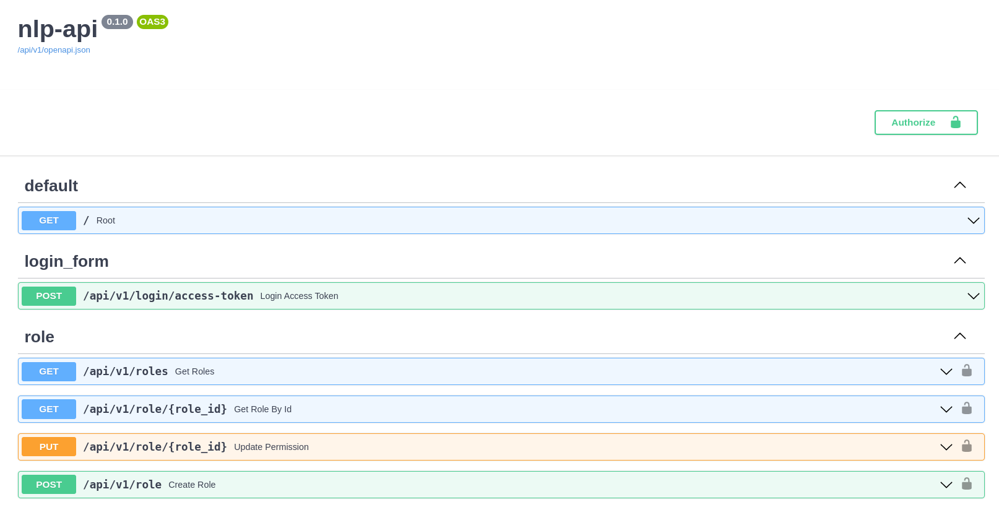

# Transformers models for Natural Language Processing API based on FastAPI, SQLModel, PostgreSQL, Alembic & Docker

This project is a Rest API which uses [XLM-roBERTa-base model](https://huggingface.co/daveni/twitter-xlm-roberta-emotion-es) for emotion analysis in texts and [Zero-shot SELECTRA model](https://huggingface.co/Recognai/zeroshot_selectra_medium) for zero-shot classification, both for Spanish language.
<br>

This project is based on [FastAPI](https://fastapi.tiangolo.com/) for the server, [Alembic](https://alembic.sqlalchemy.org/en/latest/) for database table migration, [PostgreSQL](https://www.postgresql.org/docs/) as database and async [SQLModel](https://sqlmodel.tiangolo.com/) as ORM.

## Set environment variables

Before running the project with Docker, it is required to create an **.env** file on root folder and copy the content from **.env.example** according to the application configuration.

## Run project using Docker compose

```sh
$ docker-compose up --build
```

## Run Alembic migrations

```sh
$ docker-compose exec nlp_fastapi_server alembic revision --autogenerate
$ docker-compose exec nlp_fastapi_server alembic upgrade head
```

## Setup database with initial data

This creates a sample user on databasse with **username: admin@admin.com** and **pass: admin**

```
docker-compose exec nlp_fastapi_server python app/initial_data.py
```

You can connect to Database using pgAdmin4 and use the credentials from .env file. Database port on local machine has been configured to **5454** on docker-compose.yml file

## ERD Database model

<p align="center">
  
</p>

Documentation: [http://localhost:8000/docs](http://localhost:8000/docs)

## Preview

<p align="center">
  
</p>
<p align="center">
  
</p>

## Tables preview on pgAdmin4

<p align="center">
  
</p>
<p align="center">
  
</p>
<p align="center">
  
</p>
<p align="center">
  
</p>

## Inspiration and References

- [fastapi-alembic-sqlmodel-async](https://github.com/jonra1993/fastapi-alembic-sqlmodel-async)
- [full-stack-fastapi-postgresql](https://github.com/tiangolo/full-stack-fastapi-postgresql).
- [fastapi-sqlmodel-alembic](https://github.com/testdrivenio/fastapi-sqlmodel-alembic).
- [sqlmodel-tutorial](https://sqlmodel.tiangolo.com/tutorial/fastapi/).

## License

[](http://badges.mit-license.org)

- This project is licensed under the terms of the **[MIT license](LICENSE)**
